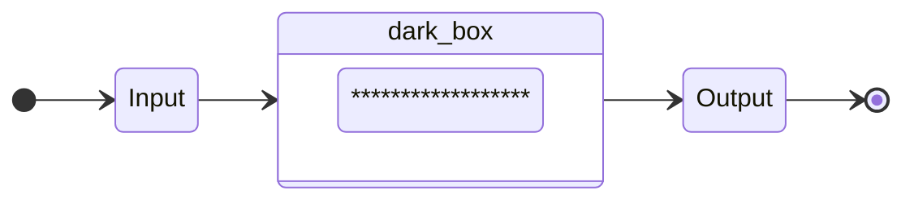
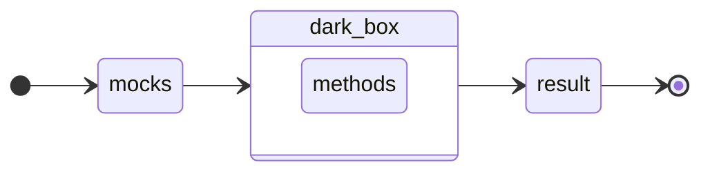

# Testing!

Testing de caja negra, por que dentro de lo que es el frontend, se pueden probar muuuchas cosas.

## Que es el unit test?

Son pruebas unitarias. Que es lo que vamos a probar?
En los tests de caja negra, se prueba la logica de negocio.

Hay que hacer pruebas unitarias tanto en el front como en el back.

Beneficios de los unit tests: 

- Reducir la necesidad de codigo o pruebas manuales.
- Mejorar la calidad de codigo.
- Nos permite tener un correcto mantenimiento del codigo 
- El unit testing es una buenna inversion de tiempo.
- SE EJECUTA ANTES DE SUBIR A GIT || Bitbucket

## Prioritarios

- Mocks
- Caja negra
- Happy path
- Sad Path
- Arquitectura -> Testing

### Mocks

Un mock es tratar de cambiar como funciona una propiedad o una funcionalidad, a un ambiente controlado.

**Variable**
```js
const user = ??

const userMock = "castromaciellr'
```

**Método**
```js
const suma = (var1, var2) => var1 + var2

const sumaMock = () => 2
```

> "Siempre devuelve lo que esperamos"

Recomendacion: crear mock de los endpoints

```js
const login = async (email, password) => await postLogin(email, password)

const loginMock = async (email, password) => await Promise.resolve(true)
                                          => await Promise.reject(error)
```

### Caja negra

Simple diagrama de flujo



Caso real



> Para que nuestro test sea exitoso, el resultado tiene que ser igual a un resultado esperado.

#### Estructura recomendada para hacer unit testing.

```ts
const suma = (var1: number, var2: number):number => var1 + var2;
```

```ts
it('Should add two variables', () => {
  // Mocks or entries
  const var1Mock = 3
  const var2Mock = 7

  const expectedResult = 10
  // ----------------------

  const result = suma(var1Mock, var2Mock)

  expect(result).toEqual(expectedResult)
})
```

#### Pasos a tener en cuenta para escribir testing.

1. Identificar lógica de negocio. (Requerimentos del componente).
2. Identificar que resultado queremos que tenga o efectos de ejecutar nuestra lógica.
3. Crear los mocks de datos de entrada y de la logica externa.
4. Identificar casos extremos. (Si o si deben probarse)

### Happy path (Camino feliz) 😎

Siempre debe ocurrir. Es también lo que se llama acceptance critera / criterios de aceptación.

### Sad path (Camino triste) 🥲

Prioritario. Aqui va todo lo que no cumple con los criterios de aceptación como también los casos extremos.

### Recomendaciones:

Que hago cuando ya tengo un proyecto finalizado, pero no tenemos testing???

1. Aplicar testing siempre en todo lo nuevo. (Sin excepción).
2. Tenemos codigo muy acoplado = No se puede dividir sin hacer refactor.
    * Identificar funcionalidades prioritarias
    * _**Tratar**_ de hacer mocks metodos excluyentes
    * Definir nuevamente los _**Happy path**_ 
    * Definir nuevamente los _**Sad path**_ -> Si o si los casos extremos.

### Test coverage (Covertura de codigo) 🧪

Hay muchas formas de verlos. Se usan distintas variantes/conceptos.
Son los diferentes caminos que se estan testeando.

Covertura que va a estar definida por **Lineas de código**

Por ejemplo un Login con 20 lineas de codigo, y nosotros tenemos testeadas 18 lineas de codigo, entonces el coverage es de un 90%.

El porcentaje que se tiene que alcanzar es aproximadamente un 80% Para codigos prioritarios !!! 

Ejemplo:

```ts
const isHigher = (var1: number, var2: number) => {
  if (var1 > var2) {
    console.log('es mayor')
  } else {
    console.log('es menor')
  }
}
```


// **Sad Path**
```ts
(2, 3) => {
  if (2 > 3) ✅
  ...
  else { ✅
    console.log('es menor') ✅
  }
}
```

Supongamos que este test nos da un 60% del coverage

// **Happy Path**
```ts
(3, 2) => {
  if (3 > 2) ✅
    console.log('es mayor')
  ...
}
```
Supongamos que este test nos da un 40% del coverage

Sumando ambas pruebas, hacemos un 100% del coverage.
