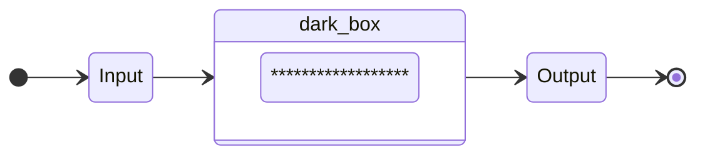
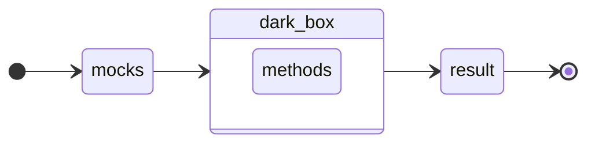

# Testing!

Testing de caja negra, por que dentro de lo que es el frontend, se pueden probar muuuchas cosas.

## Que es el unit test?

Son pruebas unitarias. Que es lo que vamos a probar?
En los tests de caja negra, se prueba la logica de negocio.

Hay que hacer pruebas unitarias tanto en el front como en el back.

Beneficios de los unit tests: 

- Reducir la necesidad de codigo o pruebas manuales.
- Mejorar la calidad de codigo.
- Nos permite tener un correcto mantenimiento del codigo 
- El unit testing es una buenna inversion de tiempo.
- SE EJECUTA ANTES DE SUBIR A GIT || Bitbucket

## Prioritarios

- Mocks
- Caja negra
- Happy path
- Sad Path
- Arquitectura -> Testing

### Mocks

Un mock es tratar de cambiar como funciona una propiedad o una funcionalidad, a un ambiente controlado.

**Variable**
```js
const user = ??

const userMock = "castromaciellr'
```

**Método**
```js
const suma = (var1, var2) => var1 + var2

const sumaMock = () => 2
```

> "Siempre devuelve lo que esperamos"

Recomendacion: crear mock de los endpoints

```js
const login = async (email, password) => await postLogin(email, password)

const loginMock = async (email, password) => await Promise.resolve(true)
                                          => await Promise.reject(error)
```

### Caja negra

Simple diagrama de flujo



Caso real



> Para que nuestro test sea exitoso, el resultado tiene que ser igual a un resultado esperado.

#### Estructura recomendada para hacer unit testing.

```ts
const suma = (var1: number, var2: number):number => var1 + var2;
```

```ts
it('Should add two variables', () => {
  // Mocks or entries
  const var1Mock = 3
  const var2Mock = 7

  const expectedResult = 10
  // ----------------------

  const result = suma(var1Mock, var2Mock)

  expect(result).toEqual(expectedResult)
})
```

#### Pasos a tener en cuenta para escribir testing.

1. Identificar lógica de negocio. (Requerimentos del componente).
2. Identificar que resultado queremos que tenga o efectos de ejecutar nuestra lógica.
3. Crear los mocks de datos de entrada y de la logica externa.
4. Identificar casos extremos. (Si o si deben probarse)
