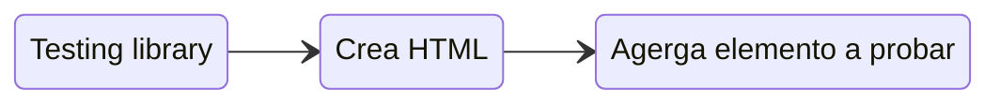
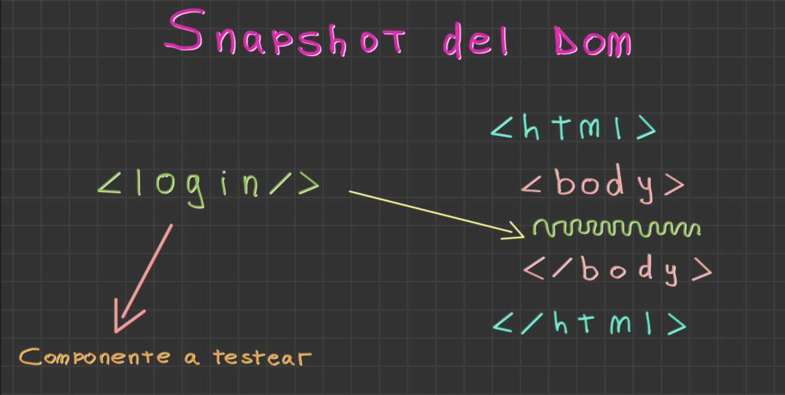

# Testing library

React testing library introduce una nueva API cuyos principales métodos son _**render**_ y _**screen**_. Con render podemos montar un componente de la forma habitual en React y con el singleton screen podemos leer lo que hay en él. Está centrado en el usuario

Javascript -> Testing Framework

Typescript -> Testing Library

Podemos introducir testing a cualquiera de estos frameworks.
Cambia el paradigma de hacer unit testing, esto es por que ahora los tests estan centrados en la interaccion que tiene el usuario para/con nuestros components.

Caracteristicas: 

- Ignora detalles de implementación
- Consulta el _**DOM**_

## Glosario del testing:

### describe

Consulta todos los test que describen el comportamiento que debe tener nuestro elemento a probar.

### Mock

Un mock es tratar de controlar lo que son variables y metodos con lo que nosotros esperamos. Por ejemplo si nosotros llamamos al login, esperamos una respuesta con informacion del usuario que esta iniciando.
Esta informacion es dinamica. por ello es que podemos generar un mock, que lo que hace es controlar este resultado.

```tsx
const mockedUser = {
  name: 'castromaciel',
  email: 'castromaciel@gmail.com'
}
```

### afterEach

Logica que se ejecuta luego de cada test, especial para volver a inicializar los mocks de prueba a sus valores iniciales.

```tsx
afterEach(jest.clearAllMocks)
```

### beforeEach

Se ejecuta antes de cada test. Recomendado para preparar funcionalidades que se reutilizan entre cada test.

```tsx
beforeEach(() => {
  render(<Login />)
})
```

## Estructura con jest

```tsx
// describe el comportamiento del elemento
describe('Componente', () => {
  // a quien describimos

  beforeEach(() => {
    // antes de cada test
  })

  afterEach(() => {
    // despues de cada test
  })

  // describe que debe hacer
  it('Hacer algo', () => {
    // logica del test
  })
})
```

```tsx
describe('Login', () => {
  let renderInstance;
  const mockedUser = {
    name: 'castromaciel',
    email: 'castromaciel@gmail.com'
  };

  beforeEach(() => {
    renderInstance = render(<Login />);
  })

  afterEach(jest.clearAllMocks)

  it('should render login', () => {
    expect(renderInstance).toBeTruthy();
  })
})
```

## Mindset Testing library



### Importante !!

Para que el testing se realice correctamente

- Atomicidad
- Cada componente debe ocuparse de una única lógica
- Componentes reutilizables
- Componentes que no requieran de otros

> Esto nos facilitará el testing

### Snapshot del DOM



#### Como accedemos al snapshot? 

Importar el metodo **screen** de la librería.

Screen es el metodo para poder interactuar y consultar con el DOM, es el DOM simulado que nos brinda testing library.

## Tipos de queries

Hay fundamentalmente 3 tipos de query

  - **getBy**: Obtiene el elemento que cumpla con la condicion de la query y devuelve un error en dos casos
    - Si no encuentra ningun elemento
    - Si encuentra mas de uno

  - **queryBy**: Es similiral al getBy con la diferencia de que no da un error si no encuentra el elemento. Es generalmente utilizado para opcionales.

  - **findBy**: Espera un determinado tiempo a que se cumpla la condición por medio de una promesa, si no se cumple esta se rechaza.

> Para buscar más de un elemento, agregar la palabra "_**all**_" al tipo de query.

Ej: **getAllby**

### Principales queries.

  - **ByRole**: especial para encontrar elementos por el rol que cumplen. Los roles asigandos por el browser (button, tab).

    ```ts
    screen.getByRole('button', { name: 'Mi texto' })
    ```

  - **ByLabelText**: elemento que contenga el label que indicamos:
    ```ts
    screen.getByLabelText('Mi label')
    ```

  - **ByText**: elemento con el texto indicado
    ```ts
    screen.getByText('Mi texto')
    ```

  - **ByTestId**: podemos introducir el atributo _data-testid_ para identificar los elementos (este se elimina sol al pasar a producción)
    ```tsx
    <div data-testid='mi-elemento'>Elemento</div>

    screen.getByTestId('mi-elemento')
    ```

## Sincrono

Consultar en el snapshot si el elemento existe en este instante.

```ts
expect(screen.getByText('Existo, luego pienso')).toBeInTheDocument()
```

Esto es sencillo siempre y cuando no tengamos renders que dependan de ciertas condiciones.

## Asincrono

Vamos a esperar a que suceda cierta interaccion del usuario para que aparezca el elemento en pantalla.

1. Importar método **waitFor**, este espera por todo lo que pongamos en su interior.

    waitFor
    ```ts
    await waitFor(() =>{
      expect(screen.getByText('Pienso, luego existo')).toBeInTheDocument()
    })
    ```
    ```ts
    it("muestra en pantalla 'mi texto'", async() => {


      await waitFor(() =>{
        expect(
          screen.getByText('mi texto')).toBeInTheDocument()
      })
    })
    ```
    > Si no aparee luego de un tiempo, se considera un **test fallido**

2. Uso de **findBy**, esperará por la condición y si no lo hace, dará un error.
    ```ts
    await screen.findByText('mi texto')
    ```
    ```ts
    expect(await screen.findByText('Pienso, luego existo')).toBeInTheDocument()
    ```

## Ejemplos de uso

```tsx
<h3>Esto es un test</h3>

screen.getByText('Esto es un test')
```

```tsx
<input type="text" data-testid="input-test" />

screen.getByTestId('input-test')
```

```tsx
(... texto luego de una carga ...)
<p>tu valor es: { value }</p>

await waitFor(() => {
  expect(screen.getByText("tu valor es: valueFromApi")).toBeInTheDocument()
})
```
